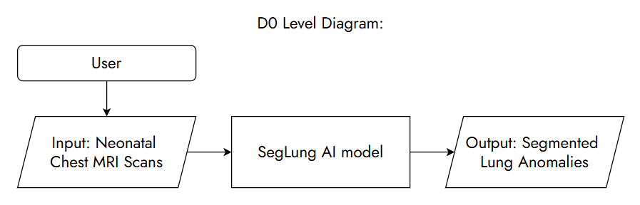
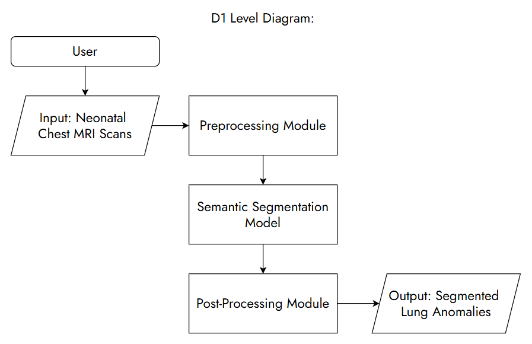
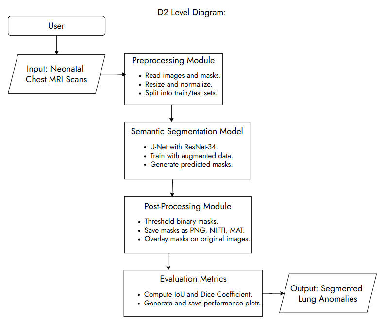

# Design Diagrams

## Project Title & Goal Statement

**Title:** SegLungAI \
**Goal Statement:** This project aims to automate the detection and segmentation of neonatal lung anomalies in MRI scans using advanced semantic segmentation techniques, reducing manual intervention and improving accuracy in medical imaging analysis.

 

## Diagrams

### D0

### D1

### D2

 

## Diagram Interpretation

- **D0 Diagram:** Represents the highest-level overview of the system, showing the basic input (MRI scans) and output (segmented lung masks).
- **D1 Diagram:** Breaks the system into subsystems:
  - Data Input and Preprocessing
  - Semantic Segmentation Model
  - Post-Processing
  - Evaluation Metrics
- **D2 Diagram:** Provides a detailed breakdown of the system, including:
  - Specific components for preprocessing, model training, and post-processing.
  - Detailed flows for data augmentation, thresholding, and evaluation.

### Symbols and Conventions:
- **Rectangles**: Represent processes or modules.
- **Parallelograms**: Represent data inputs/outputs.
- **Ovals**: Represent start/end points of the flow.
- **Arrows**: Indicate the flow of data and interactions between modules.
- **Solid lines**: Represent direct data flows or processes.
- **Dotted lines**: Indicate optional or secondary interactions to avoid overlapping paths.
