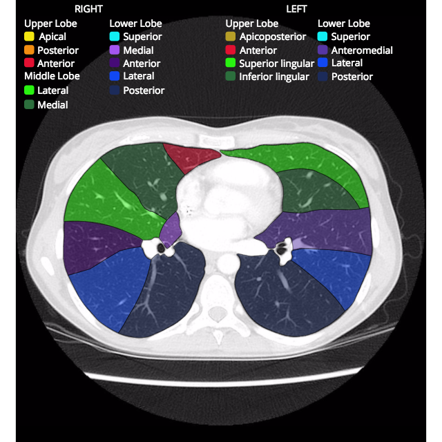

# **Project Description**

## **Team Member(s)**
- **Jason C. Woods, PhD** (Faculty Advisor)
  Professor, UC Department of Pediatrics
  Email: [jason.woods@cchmc.org](mailto:jason.woods@cchmc.org)
  
- **Alex Matheson, PhD** (Advisor)
  Research Fellow, Department of Pulmonary Medicine within the CPIR
  Email: [alexander.matheson@cchmc.org](mailto:alexander.matheson@cchmc.org)
  
- **Abdullah Bdaiwi, PhD** (Advisor)
  Research Fellow, Department of Pulmonary Medicine within the CPIR
  Email: [abdullah.bdaiwi@cchmc.org](mailto:abdullah.bdaiwi@cchmc.org)

- **Dhyey Patel**  
  Major: Computer Science  
  Email: [patel4du@mail.uc.edu](mailto:patel4du@mail.uc.edu)

## **Project Topic Area**
The **SegLungAI** project aims to develop an AI-driven solution for automatic lung anomaly detection and segmentation in neonates using CT and MRI chest scans. The primary objective is to achieve high-accuracy lung segmentation through semantic segmentation techniques in Python. The project will begin by segmenting lungs from chest scans of neonates, utilizing 30 anonymized images provided by Cincinnati Children's Hospital. As the project progresses, new goals and features will be added to further enhance model performance.

### **Faculty Advisor**
- **Jason C. Woods, PhD**  
  Professor, UC Department of Pediatrics  
  Email: [jason.woods@cchmc.org](mailto:jason.woods@cchmc.org)  
  Dr. Woods will serve as the project supervisor, providing guidance, task assignment, and support throughout the project.

### **Additional Guidance**
- **Alex Matheson, PhD**  
  Research Fellow, Department of Pulmonary Medicine  
  Email: [alexander.matheson@cchmc.org](mailto:alexander.matheson@cchmc.org)  
  Dr. Mathewson will assist by providing resources, data, and any existing codebase, offering guidance as needed throughout the project.

## **Project Abstract**
**SegLungAI** will leverage semantic segmentation techniques to automatically detect and segment lung regions in chest CT and MRI scans. The goal is to develop an AI model in Python that achieves high accuracy in lung segmentation, reducing the need for manual corrections. As the project progresses, additional features and improvements will be incorporated to enhance model performance and extend the project’s capabilities.

## **Problem Statement**
Previously, lung segmentation from chest CT/MRI scans was done manually, taking months to complete for each patient and scan. While there are existing tools for segmentation, they still lack the accuracy needed to eliminate the need for manual review, which still requires human oversight for correcting mislabels or missing data.

## **Current Solutions and Gaps**
Current neonatal lung segmentation methods often lack the precision required for clinical use. Existing tools fail to fully address the complexities of neonatal CT/MRI scans, which vary in quality and resolution, leading to inaccuracies that require human intervention.

## **Technical Background**
The project will utilize Python and machine learning, focusing on semantic segmentation techniques with libraries such as TensorFlow or PyTorch. Medical imaging tools like OpenCV will also be employed. A deep learning model will be trained on 30 anonymized neonatal chest CT/MRI scans provided by Cincinnati Children’s Hospital.

## **Approach**
The project will begin with the pre-processing of the provided image data. A semantic segmentation model will be developed to detect and segment lung structures. The model's performance will be evaluated and iteratively improved to achieve higher accuracy and minimize the need for manual review.

## **Lung Segmentation Example**

An example of lung segmentation can be seen in the following case, where bronchopulmonary segments are annotated on an arterial phase axial chest CT scan:

**Case courtesy of Peter Jenvey, [Radiopaedia.org](https://radiopaedia.org/?lang=us). From the case [rID: 54511](https://radiopaedia.org/cases/bronchopulmonary-segments-annotated-ct-2).**

Annotated bronchopulmonary segments on arterial phase axial chest CT.

This image highlights the detailed segmentation of lung regions, which is similar to the goal of our project—accurately segmenting neonate lung images using AI-driven methods.

## **Goals**

1. **Segment Lungs from Neonatal Chest CT/MRI Scans**
   - Develop and implement a robust pipeline to pre-process and segment lung regions from neonatal chest CT and MRI scans.
   - Use semantic segmentation techniques to accurately delineate lung boundaries, focusing on the unique challenges of neonatal scans (e.g., smaller size, variations in quality).
   - Ensure the model is capable of handling the 30 anonymized neonatal scans provided by Cincinnati Children's Hospital, with the goal of generalizing to other neonatal scans in the future.

2. **Refine the Segmentation Model to Enhance Accuracy and Reduce Manual Oversight**
   - Continuously evaluate the segmentation model using metrics like Dice Similarity Coefficient (DSC) and Intersection over Union (IoU) to measure performance.
   - Implement iterative training with data augmentation techniques (e.g., rotation, scaling) to improve model robustness and prevent overfitting.
   - Fine-tune the model by incorporating feedback from manual review of segmentations and adjusting the model’s hyperparameters.
   - Introduce an active learning approach, where the model learns from human-corrected segmentations to improve over time, reducing the need for manual corrections.

3. **Expand the Project to Include Additional Datasets and Improve the Model’s Performance Across a Wider Range of Cases**
   - Incorporate diverse datasets, including those from different hospitals or neonatal conditions, to ensure the model is not biased toward a specific dataset.
   - Investigate multi-modal segmentation by incorporating other imaging modalities (e.g., X-ray, ultrasound) to enhance the model's versatility.
   - Explore the application of transfer learning using pre-trained models (e.g., U-Net, DeepLabV3) to boost initial performance and training speed.
   - Aim for the model to reach clinical-grade performance, minimizing the need for manual corrections, and be adaptable to other pediatric imaging tasks beyond lung segmentation.
